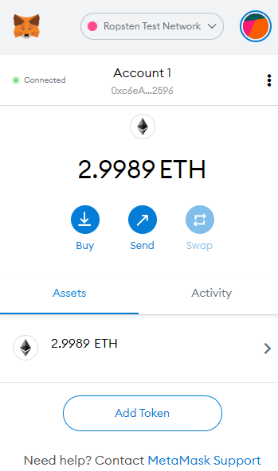
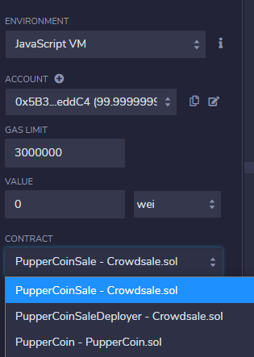
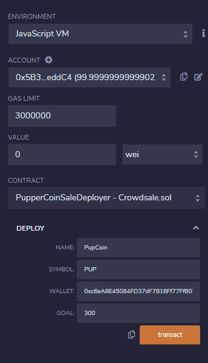
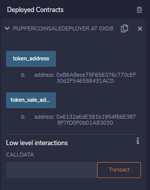
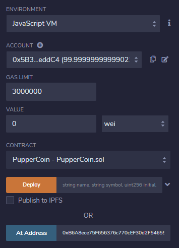
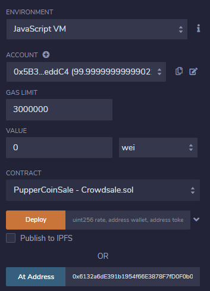
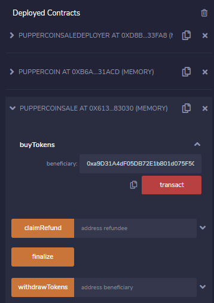
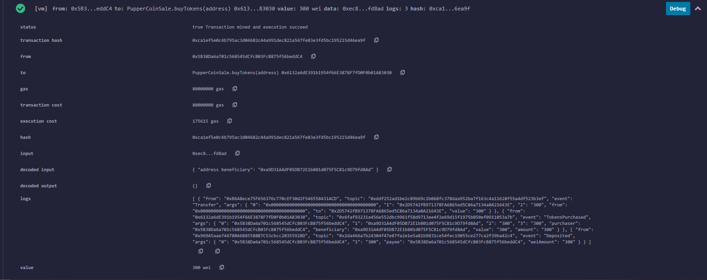

# Unit 21: You sure can attract a crowd!

## Background

Your company has decided to crowdsale their PupperCoin token in order to help fund the network development.
This network will be used to track the dog breeding activity across the globe in a decentralized way, and allow humans to track the genetic trail of their pets. You have already worked with the necessary legal bodies and have the green light on creating a crowdsale open to the public. However, you are required to enable refunds if the crowdsale is successful and the goal is met, and you are only allowed to raise a maximum of 300 Ether. The crowdsale will run for 24 weeks.

You will need to create an ERC20 token that will be minted through a `Crowdsale` contract that you can leverage from the OpenZeppelin Solidity library.

This crowdsale contract will manage the entire process, allowing users to send ETH and get back PUP (PupperCoin).
This contract will mint the tokens automatically and distribute them to buyers in one transaction.

It will need to inherit `Crowdsale`, `CappedCrowdsale`, `TimedCrowdsale`, `RefundableCrowdsale`, and `MintedCrowdsale`.

You will conduct the crowdsale on the Kovan or Ropsten testnet in order to get a real-world pre-production test in.

---
## Instructions

### Designing the contracts

#### ERC20 PupperCoin Configuration:
[Crowdsale.sol](../Starter-Code/Crowdsale.sol)
#### PupperCoinCrowdsale Configuration:
[PupperCoin.sol](../Starter-Code/PupperCoin.sol)

---
## Deploying the Crowdsale

Deploy the crowdsale to the Kovan or Ropsten testnet and store the deployed address for later. Switch MetaMask to your desired network, and use the `Deploy` tab in Remix to deploy your contracts. If neccesary, prefund your wallets using the appropriate faucet.

Compile PupperCoin.sol, which should give you access to the contracts PupperCoin, PupperCoinSale, and PupperCoinSaleDeployer

Deploy PupperCoinSaleDeployer and fill out the contract with the name PupperCoin, symbol PUP and the desired wallet address and goal. For this example, our goal will be 300. Confirm the transaction when prompted on MetaMask.

You should now see the token_address and token_sale_address in the deployed PupperCoinSaleDeployer contract. These will be used shortly.

Next, deploy the PupperCoin contract and fill in the "At Address" using the token_address from PupperCoinSaleDeployer. Click on the "At Address" button to deploy the contract.

Now deploy the PupperCoinSale contract and fill in the "At Address" using the token_sale_address from PupperCoinSaleDeployer. Click on the "At Address" button to deploy the contract.

You can now open up the deploy PupperCoinSale contract and set the beneficiary using the desired wallet address.

If done correctly, you will see a successful transaction on the blockchain!

